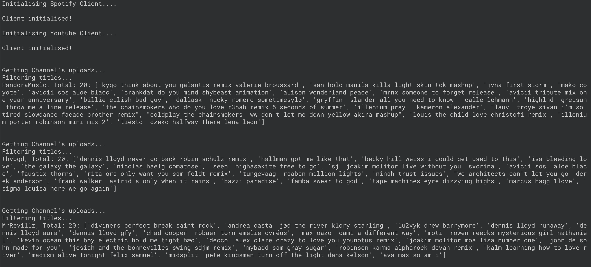
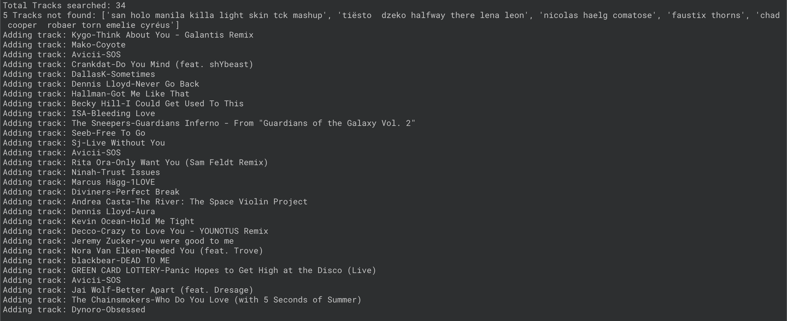
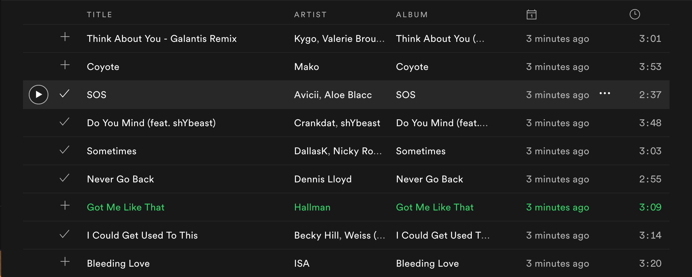

# YoutubeToSpotify

A Python script to fetch tracks of music channels on Youtube, find them on Spotify and add them to a playlist.
The video titles from Youtube are filtered and then searched on Spotify for near perfect results. A CSV file keeps track of the tracks that are added to the Spotify playlist so the script can be executed when required.




### Getting Started

You need these before running the script:
* Login to [Spotify Developer Dashboard](https://developer.spotify.com/dashboard/) and create a new app to obtain the Client ID and Client Secret. 
Add these to **CLIENT_ID** and **CLIENT_SECRET** in the code.
After this, click edit settings of the newly created app and add http://localhost/ to Redirect URIs and save. 

* Get the Youtube API key [here](https://developers.google.com/youtube/v3/getting-started) and add it to **API_KEY** in the code.

* [Spotipy](https://spotipy.readthedocs.io/en/latest/) : Spotipy is a lightweight Python library for the Spotify Web API. 
With Spotipy you get full access to all of the music data provided by the Spotify platform.

* The [Google APIs Client Library](https://developers.google.com/youtube/v3/getting-started) for Python for making requests to Youtube

* Create a new Spotify Playlist and name it anything you want. 
Get your spotify username and the playlist id. 
Copy the username and playlist ID and add them to **SPOTIFY_USERNAME** and **YOUTUBE_PLAYLIST_ID** in the code respectively.
```
Right click on the playlist in Spotify and go to Share > Copy Spotify URI. 
```
You will receive a URI like this:
```
spotify:user:john:playlist:70WcLyhxyzRuSGf678MyPd
```

### Installing

To install Spotipy
```
pip install spotipy
```

To install Google API

```
pip install google-api-python-client
```

## Adding channels 

To add channels from Youtube, simply access a channel page and examine the URL. If it is like:
```
https://www.youtube.com/user/ChillStepNation
```
Just add the part after https://www.youtube.com/user/ to **CHANNEL_USERNAMES** list in the code. In this case, ChillStepNation.

If the URL is like:
```
https://www.youtube.com/channel/UCkjnVMHy 
```
Add the part after https://www.youtube.com/channel/ (Here, UCkjnVMHy) to **CHANNEL_IDS** dictonary in the code in the format:
```
{'channelName' : 'channelID'}
```
To change the number of search results for each channel change **MAX_RESULT** in the code. Default is 20.


